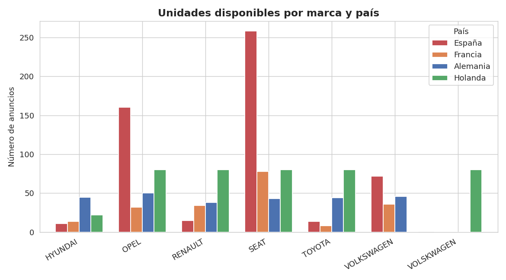
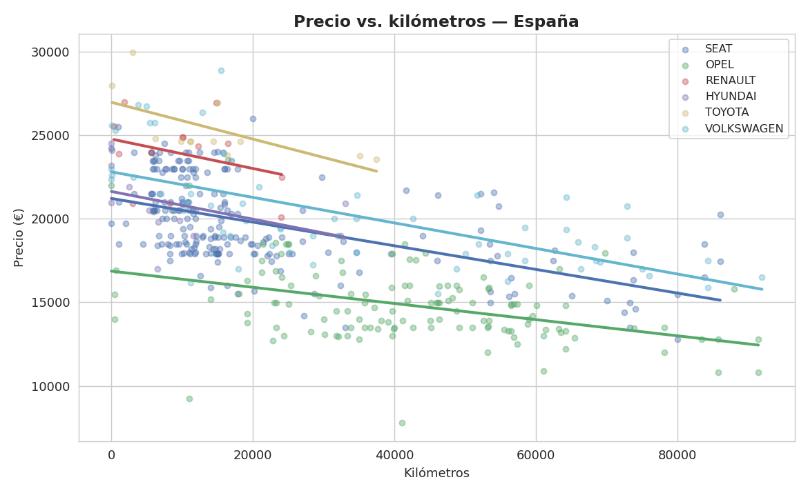
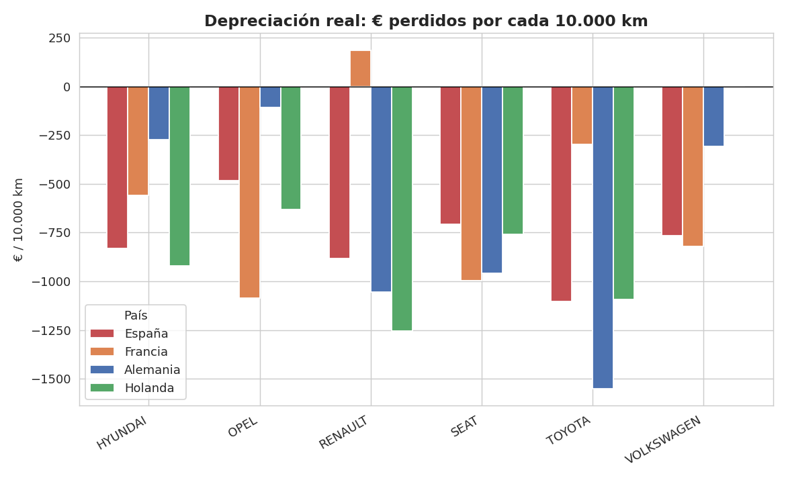

# Cómo se deprecian los coches de ocasión — scraping y análisis en 4 mercados europeos 🚗


¿Un mismo coche pierde valor al mismo ritmo en España que en Alemania? Para responder con datos reales —no con intuición— hicimos web scraping de 7 portales de coches de ocasión en 4 países, siguiendo 6 modelos y acabados muy concretos, y cuantificamos cómo se deprecia cada uno según el kilometraje, mercado por mercado.

---

## 📂 Estructura del repositorio

```text
├── data/
│   ├── raw/                       # csv en bruto, uno por portal
│   └── processed/                 # csv limpios y unificados, uno por país
├── notebooks/
│   ├── data_cleaning.ipynb        # limpieza y fusión de los csv por país
│   ├── year_vs_country.ipynb      # distribución por año de matriculación
│   ├── cars_by_country.ipynb      # unidades disponibles por marca y país
│   └── price_vs_mileage.ipynb     # relación precio-kilómetros
├── src/
│   ├── main.py                    # orquestador: llama a cada scraper y genera los csv
│   └── scrapers/                  # un scraper (Selenium) por portal
├── assets/images/                 # gráficas generadas a partir de los datos reales
├── requirements.txt
├── LICENSE
└── README.md
```

---

## 🎯 El planteamiento

En vez de comparar "coches en general" entre países —donde cualquier diferencia de precio podría deberse a que se están comparando cosas distintas—, elegimos **6 modelos y acabados muy concretos** (Seat Ibiza FR, Opel Corsa GS-Line, Renault Clio Espirit Alpine, Hyundai i20 N-Line, Volkswagen Polo R-Line, Toyota Yaris GR Sport) y los buscamos en los mismos 4 mercados: España, Francia, Alemania y Holanda. Así cualquier diferencia que aparezca es comparable de verdad, no un artefacto de estar comparando peras con manzanas.

## 📊 Fuentes de datos

| País | Portales |
|---|---|
| 🇪🇸 España | Autocasión, Clicars, Flexicar, Ocasión Plus |
| 🇫🇷 Francia | AutoScout24 Francia |
| 🇩🇪 Alemania | Mobile.de |
| 🇳🇱 Holanda | AutoScout24 Holanda |

> Cada portal necesitó su propio scraper porque cada uno organiza el HTML de forma distinta.

## 🧪 Metodología

1. **Scraping (Selenium):** un script por portal, cada uno busca los 6 modelos/acabados y extrae marca, modelo, año, kilómetros y precio.
2. **Limpieza y fusión** (`data_cleaning.ipynb`): normaliza formatos de precio/kilómetros —cada portal los presenta de forma distinta— y agrupa los portales españoles en un único dataset por país.
3. **Análisis exploratorio:** distribución de antigüedad y unidades disponibles por marca y país.
4. **Relación precio-kilómetros:** regresión por marca, comparando la pendiente entre países.

---

## 📈 Visualizaciones

### Unidades disponibles por marca y país



Cada marca tiende a tener mucha más presencia de anuncios en su país de origen o mercado más fuerte — Seat en España es el caso más claro.

### Precio vs. kilómetros (España)



En todas las marcas y mercados, más kilómetros implica menor precio — pero el ritmo al que cae varía por marca, lo cual es justo lo que cuantificamos a continuación.

### Depreciación real por marca y país



## 📉 Cuánto se deprecia cada coche por cada 10.000 km

Las gráficas de precio-kilómetros muestran la relación, pero sin cuantificarla en un número. Para poder comparar países de verdad, calculamos la pendiente de una regresión lineal simple (precio ~ kilómetros) por marca y país:

| Marca | España | Francia | Alemania | Holanda |
|---|---|---|---|---|
| Seat | -708 € | -996 € | -958 € | -758 € |
| Opel | -484 € | -1.086 € | -109 € | -633 € |
| Renault | -882 €† | +186 €† | -1.053 € | -1.254 € |
| Hyundai | -829 €† | -560 €† | -275 € | -921 € |
| Toyota | -1.101 €† | -296 €† | -1.549 € | -1.093 € |
| Volkswagen | -765 € | -821 € | -308 € | -902 € |

*(€ de precio perdido por cada 10.000 km adicionales. † = muestra pequeña, n<15 — dato indicativo, no concluyente.)*

Tomando solo las combinaciones con muestra suficiente (n≥15): **Holanda deprecia más (-927 €/10.000km)**, seguida de Alemania (-709 €) y Francia (-679 €); **España es donde menos se deprecia (-652 €/10.000km)**.

## 💼 Para qué serviría esto en la práctica

Esto no es solo "hicimos scraping por hacer scraping". Una empresa de renting o de gestión de flotas que decide en qué mercado vender sus vehículos al terminar el contrato, o una compradora de coches de ocasión que opera en varios países, se hace exactamente esta pregunta: ¿en qué país retiene mejor su valor un coche con muchos kilómetros? Con este enfoque —mismo modelo, mismo acabado, país por país— se podría construir una recomendación real de "vende en X, no en Y", en vez de basarse en intuición o en medias de mercado poco comparables.

---

## 🔧 Limitaciones y qué mejoraríamos

- **Tamaño de muestra desigual entre países:** algunas combinaciones marca-país tienen muy pocos anuncios (Toyota en Francia: 8), lo que las hace poco fiables — están marcadas explícitamente en la tabla en vez de presentarse como si todo pesara igual.
- **Regresión simple, no controlada:** la pendiente por marca-país no controla por año de matriculación, estado del vehículo ni opcionales. Una regresión múltiple (precio ~ km + año + país) daría una estimación más limpia del efecto puro de los kilómetros.
- **Un problema real en los datos en bruto de Autocasión:** al ejecutar la limpieza, una fila tiene el valor de kilometraje desplazado (contiene el tipo de combustible en su lugar) — es un fallo de scraping de origen, no de este repositorio, y no lo hemos corregido a ciegas porque requeriría volver a scrapear para confirmarlo.
- **Scrapers frágiles por diseño:** al depender de rutas XPath fijas de cada portal, cualquier cambio de diseño en la web rompe el scraper correspondiente.
- **Sin actualización periódica:** los datos son una foto fija del momento del scraping; el enfoque comparativo entre países debería seguir siendo válido, aunque las cifras concretas envejezcan.

## ⚙️ Cómo reproducirlo

```bash
pip install -r requirements.txt
python src/main.py                        # genera los csv en bruto (algunas llamadas están comentadas, ver el propio archivo)
jupyter notebook notebooks/data_cleaning.ipynb   # limpieza y fusión por país
```

Los notebooks de `notebooks/` ya incluyen los csv de `data/processed/` necesarios para ejecutarse sin depender de un scraping nuevo.

## 👥 Autores

- Pablo de Tarso Pedraz García
- Diego José García Callejas
- Héctor Fernández Cano
- Pedro Álvaro Martínez Gutiérrez

Grado en Ciencia de Datos e Inteligencia Artificial — Universidad Politécnica de Madrid (UPM).

## 📄 Licencia

Este proyecto está bajo licencia [MIT](LICENSE).

> Los datos se recopilaron con fines educativos y de portfolio. Antes de reutilizar o ampliar los scripts de scraping, revisa los términos de uso de cada portal.
